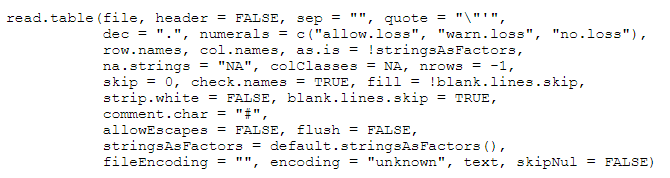
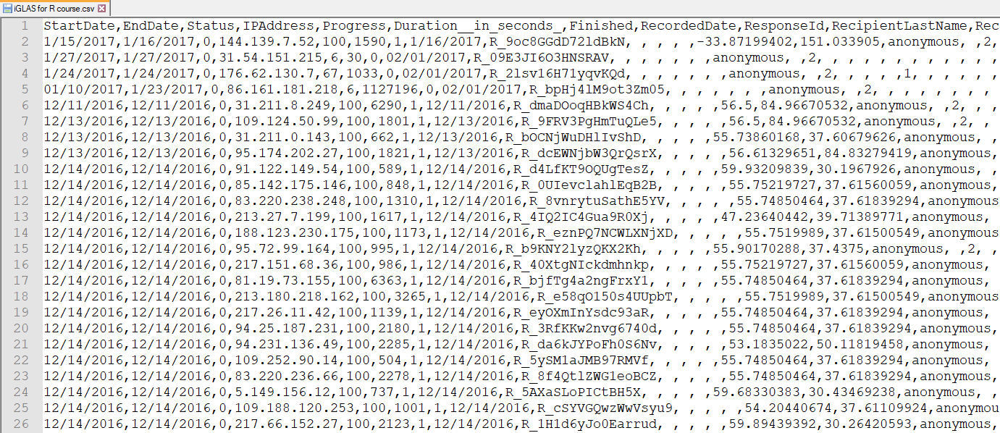
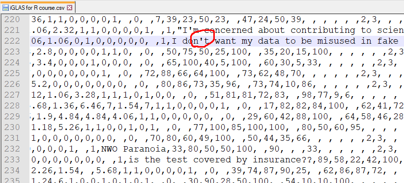
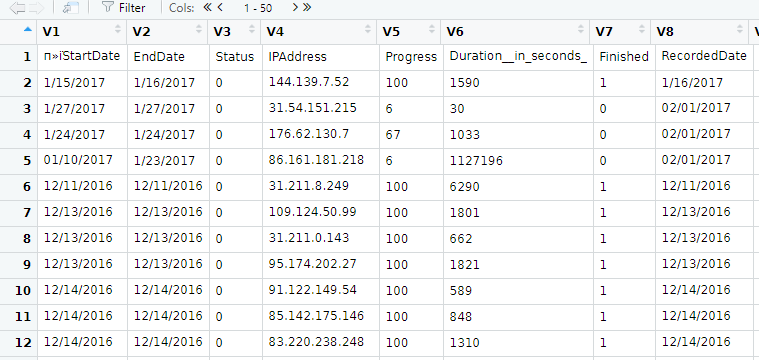

# Начнём!

## Первый слайд

Всем привет! Это наш курс про анализ данных в R. Начнём со знакомства с интерфейсом системы Rstudio. 

* Через меню File - New Project создайте новый проект. Проекты - надстройка над языком R, существующая в Rstudio. Благодаря ей можно не указывать путь к рабочей папке. 

* Создайте новый файл в проекте через меню File - New File, назовите его 01.R и сохраните. 

## 
Введите там команду, написанную ниже - и запустите её, выделив и нажав Ctrl-Enter. Пользователи MaсOS, извините. У вас это, кажется, Cmd-Enter?


```{r}
getwd()
```

Обратите внимание, вы только что *вызвали функцию*! Функция - это такая команда, которая что-то делает со своими *аргументами*. Или без них, как вы только что видели. Аргументы функции приводятся в скобках после её имени. Если у чего-то есть такие скобки - это вызов функции. 

##

* Давайте немного осмотримся. Перед вами по умолчанию должно быть четыре окна. 
  * Editor (редактирование файла). Это окно сверху - это окно с кодом вашего скрипта.

  * Console/Terminal/Jobs.  Окно внизу называется "консоль". Туда тоже можно писать команды. Но, как правило, не нужно. Там показывается ход выполнения вашего скрипта. Если выделить часть кода в редакторе и нажать Ctrl-Enter или кнопку Run - то эта часть кода отправится в консоль. И выполнится.
  
  * Environment/History etc.
  * Files/Plots/Packages etc.

##

Создайте внутри папки с проектом подпапку data, положите туда файл с данными iGLAS.

Несколько советов по организации проекта помогут нам:

1. Суть проекта определяет его структуру. 
Не слушайтесь советов и не делайте отдельную папку для данных, если у вас один единственный файл с данными, не ожидается других файлов с данными и никто никогда не увидит, что у вас неправильная структура папки проекта. 

2. Структура проекта должна быть понятна читателю. Почему мы создали папку data? 
  + Чтобы было понятно, что этот файл - наши исходные данные, а не результат обработки. Ну, как минимум мне понятно. 
    * Мне из будущего. 

##
Есть разные идеи того, как структурировать программный код вашего проекта. Например:

+ load.R
  + Здесь размещается программный код, который извлекает информацию из внешних источников данных - файлов, интернет-сайтов, баз данных. Результат пересохраняется в собственном формате R. 

+ clean.R 
  + Здесь мы занимаемся всевозможной починкой данных и их укладыванием в тот вид, который нам нужен. 

##

+ func.R
  + здесь мы храним написанные для этой задачи функции. 

+ analyze.R
  + А вот здесь вот уже наконец-то делаем дела. Таких файлов может быть несколько. Например, мы можем сделать несколько попыток с использованием разных типов анализа или разных способов работы с пропусками. 
  
##

Однако, сегодня наша основная задача - открыть файл! 

### лучше всего вначале открыть файл в текстовом редакторе и понять, какие там разделители. Под Windows рекомендую Notepad++. 

```{r error=TRUE}

  data<-read.table(file="data/iGLAS for R course.csv")

```

+ Как видите, возникла ошибка! Давайте более тщательно разберёмся с запуском функции read.table и её параметрами. Для этого выделите read.table в экране редактора и нажмите F1. 

##

Давайте обсудим основные аргументы функции read.table


## 

Посмотрим, как выглядит наш файл!
{width=450px}

##

Кажется, нам надо в нашей команде (будем здесь и далее называть вызов функции - командой) указать, что разделитель у нас - запятая. 

```{r error=TRUE}
 data<-read.table(file="data/iGLAS for R course.csv",sep=",")

```
Ой, опять что-то не так! Что-то не так на 222-й строчке! 


##


Апостроф - это же одинарная кавычка! В норме весь текст должен быть убран в двойные кавычки, как в строке 221. 

##

```{r error=TRUE}
 data<-read.table(file="data/iGLAS for R course.csv",sep=",", quote = "\"")

```

А зачем здесь \\ ? 
:-)

Ура! Всё получилось!

## 
Ну, не то чтобы совсем всё. Справа в окне Environment можно кликнуть на появившийся объект data. 




## 

```{r error=TRUE}
 data<-read.table(file="data/iGLAS for R course.csv",sep=",", quote = "\"", header=T)

```


Опять не совсем всё... 

##

Вот теперь - идеально! :-)


```{r error=TRUE}
 data<-read.table(file="data/iGLAS for R course.csv",sep=",", 
                  quote = "\"", header=T,fileEncoding = "UTF-8-BOM")

```

в этой команде вы видите основы синтаксиса R.

"<-" - присвоить значение (синоним "=")

data - объект, в который запишется то, что после
"<-".

"read.table()" - функция с набором параметров

"file","sep","header" - параметры, перечисляемые через запятую

"header=T" - присвоение параметру header значения T

T без кавычек означает True - значение типа logic

T в кавычках ("T") было бы просто буквой T, значением типа character

##

### а теперь к азам

Вектор - самая простая структура данных, из тех, с которыми вам предстоит работать. Вектор - это последовательность элементов одного и тот же типа. Вектор можно создать командой с()


```{r}

a<-c(1,2,3,3,2,1)
a
```

На имена объектов и функций в R накладываются некоторые ограничения:

1) должно состоять из букв, цифр, точек или подчёркиваний
2) не должно начинаться с числа или подчёркивания. Если начинается с точки, то вторым элементом тоже не может быть число. 

##

c числовыми векторами можно осуществлять самые разные преобразования. 

### арифметические операции
```{r}
a*2

```

##

```{r}
a*c(1,2,3,4)
a-5
a^2
a/2

```

## 
Как ни странно, довольно полезной операцией является определение остатка от деления:

```{r}
c(5,4,6,8,9)%%3
c(5,4,6,8,9)%%3 != 0
c(5,4,6,8,9)%% c(3,2) # ???
```
Так мы можем определять, является ли число чётным или делать псевдослучаные выборки вроде "каждый пятый участник исследования", если по каким-то причинам более случайные выборки не подходят. 

## 

### операции сравнения

```{r}
a<=1
a!=1
a==1
```

Обратите внимание - очень частая ошибка, a=1 сделает a равным единице, а не проверит, действительно ли а ей равно. 

##
```{r}
!c(T,F)
#логические
a<3 & a>1
 b<- a>2 | a<2
!(a>2 | a<2)


```

##


Picture from *R for Data Science* [1](https://r4ds.had.co.nz/transform.html)


##

Eщё несколько полезных команд

```{r}
c(1,3,5) %in% c(1,2,5,6,10,14,289) # что из ряда слева есть в ряде справа

any(c(F,F,F,F,F)) # есть ли хоть одно T

any(c(F,F,F,F,T))

which(c(T,T,F,F,NA,T)) # выдаёт номера элементов True 


```

## соединение векторов
Заодно обсудим recycling при слиянии и других операциях. Данные из меньшего вектора начинают повторяться, воспроизводясь в том же порядке: 
```{r}
a<-c(1,2)
b<-c(3,4)
c<-c(a,b,5,6)
c
```


##

наш датасет, хранящийся в data, имеет 329 столбиков. Каждый столбик - это вектор. Мы можем извлекать их оттуда через знак $:

```{r fig.height=3}

mean(data$iDage, na.rm=T)
hist(data$iDage)
```

##
```{r fig.height=3}
max(data$iDage)
max(data$iDage,na.rm=T)
```

##
Попробуем избавиться от подозрительных результатов:

```{r }
data[ which(data$iDage>95),"iDage"]<-NA
max(data$iDage,na.rm=T)
mean(data$iDage, na.rm=T)
round(mean(data$iDage,na.rm=T),2)
```

##

Вот мы и занялись теми операциями, которые лучше складывать в отдельный файл "clean.R"!


##


вектор может быть именованным:
```{r}
b<-c("a"=1,"b"=2,"c"=3)
b
b['b']
names(b)

```
##
К элементам вектора можно обратиться по их номеру в последовательности

```{r}
b[2]

#или сразу по вектору номеров!

b[c(1,3)]
a[2:4] #Обратите внимание на двоеточие!
b[c(T,F,T)]
```
##
```{r}
# А к столбикам датафрейма (это - датафрейм!) можно обращаться по вектору имёт столбиков! 

age_lazy<-data[c("iDage","i5lazy")]

```

Можно выделять из имён датафрейма элементы, соответствующие паттерну, с помощью команды grep. 


```{r}
data_names<-names(data)
five_point_scales<-grep("i5",data_names,value = T) 
five_point_data<-data[five_point_scales]
```

## 
вектор может быть превращён в матрицу. Для этого надо сказать, сколько в нём строчек или столбиков. 

```{r error=TRUE}
a
matrix(a[1:2],nrow=3)
```
##
```{r}
matrix(a,nrow=2,byrow=T)

```

Психологам хорошо известна, например, корреляционная матрица.

```{r}
cor1<-round(cor(five_point_data, use="pairwise.complete.obs"),3)
```

##
К элементам матрицы можно обращаться по координатам:

```{r}
cor1[1,]
```
##
```{r}
cor1[1,1]
```

```{r}
#или опять-таки - по именам! 
cor1["i5artistic","i5OPENNESS"]
dimnames(cor1)

```


##

Задания для самостоятельной работы:

1) Изучите документацию команды read.table, загрузите в data2 строки с 101 (не считая строки заголовка) по 250. Если всё вышло правильно, то среднее арифметическое шестого столбика в data2 равно  3982.273

2) Запустите команды

```{r eval=FALSE}
set.seed(123)
edible<-sample(c(T,F),30,T) # съедобное
set.seed(124)
dangerous<-sample(c(T,F),30,T) # опасное
```

##

Попробуйте написать строки кода под следующие задачи:

1. Вывести номера съедобных объектов
2. Вывести номера несъедобных объектов
3. Вывести номера съедобных и опасных объектов
4. Вывести номера объектов, которые съедобны или опасны (включающее или, т.е., все кроме одновременно несъедобных и безопасных)
5. Вывести номера объектов, которые съедобны и безопасны
6. Вывести номера объектов, которые или съедобны, или опасны (исключающее или - все, кроме одновременно съедобных и опасных)

##

3) изучите документацию к нашему датасету. Опишите 2-3 гипотезы, которые Вам интересно было бы проверить с этими данными. 


