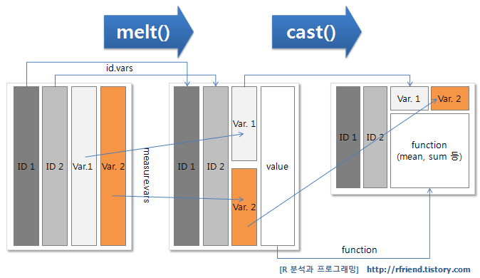

# data.table

## 
Основные материалы этого дня - в  [этой презентации](data_table.pdf).
Более полное руководство по data.table, например, [здесь](https://www.machinelearningplus.com/data-manipulation/datatable-in-r-complete-guide/). А ещё есть [cheat sheet](https://s3.amazonaws.com/assets.datacamp.com/img/blog/data+table+cheat+sheet.pdf)! 


## melt

Вчера начинали изучать вопрос про перевод в узкий формат...

```{r}
library(data.table)
load("data/iGLAS.Rdata")
DT<-data.table(data)
concerns<-grep("concern",names(data),value = T)
concerns<-concerns[1:9]
data_concerns<-melt(DT,id.vars = "ResponseId",measure.vars = concerns)
```

##



##

.N


```{r}
data_concerns[,.N]
head(data_concerns)
```

##
А теперь используем .N и by! 

```{r}
DT[,.N,by=iDkids01]
```


## вчерашний вопрос про значимые корреляции

```{r}
library(data.table)
library(psych)
correlations<-corr.test(DT[,.SD,.SDcol=five_point_scales])
r<-correlations$r
r[lower.tri(r)]<-NA
p<-correlations$p
p[lower.tri(p)]<-NA
corDT<-melt(r,value.name = "r")
pvDT<-melt(p,value.name = "p")
resultDT<-data.table(merge(corDT,pvDT))
resultDT<-resultDT[Var1!=Var2][!is.na(r)]
significant<-resultDT[p<.05]
```


## Задания для самостоятельной работы

0. Поправьте ваш файл clean.R, его надо дополнить удалением неполных ответов (поле Finished) и созданием в конце data.table из датафрейма.
1. С помощью .N сделать таблицу interest с частотой ответов на вопрос об уровне погружения в тему генетики (вопросы iDint). Желательно расшифровать числовые имена переменных во что-то более понятное. 
2. С помощью whichmax определить, в какой строке iDint - максимальное значение N. 
3. Выбрать из таблицы interest значение iDint, которое встречается максимально часто (используя предыдущие шаги)
4. Написать код, который рассчитает процент ответов на каждый из пунктов iDint
5. А теперь то же самое, но в зависимости от наличия/отсутствия детей. 
